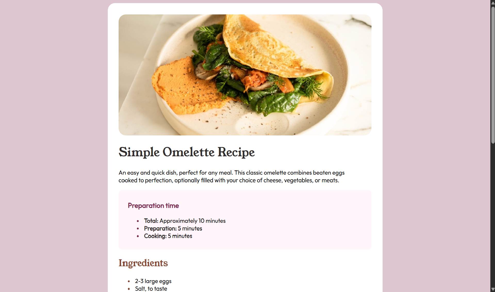
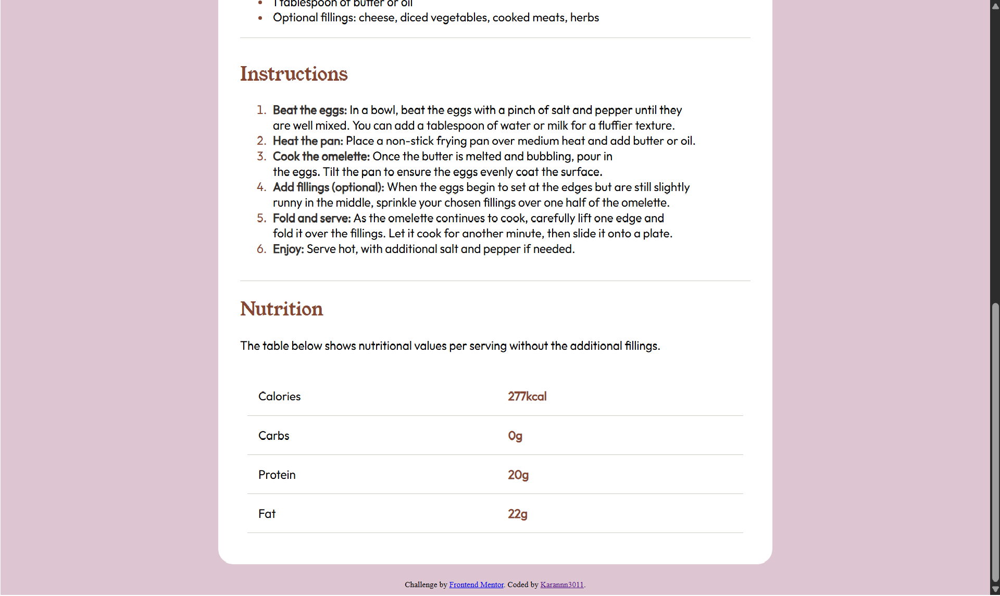
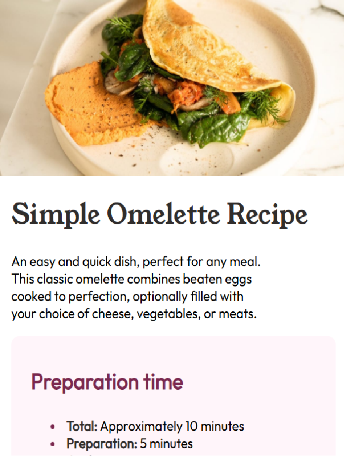
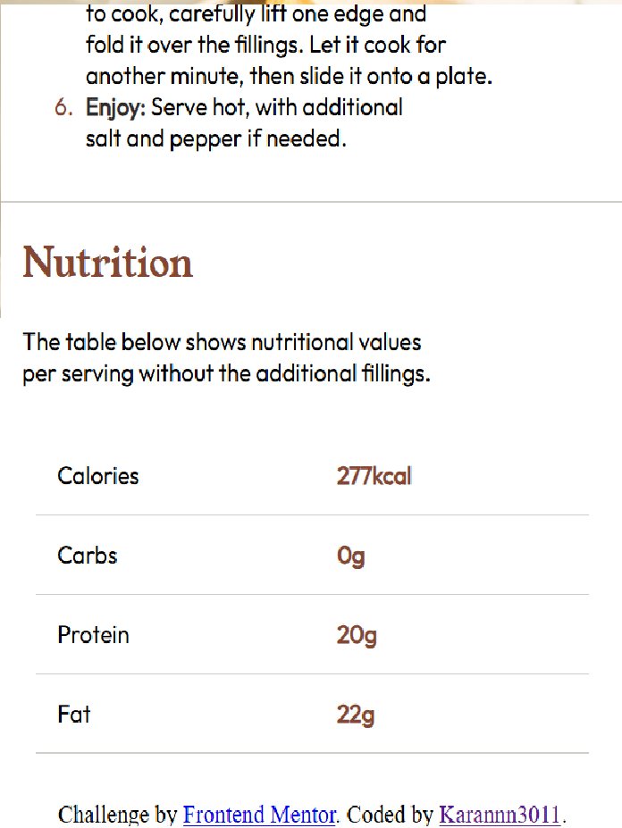

# Frontend Mentor - Recipe page solution

This is a solution to the [Recipe page challenge on Frontend Mentor](https://www.frontendmentor.io/challenges/recipe-page-KiTsR8QQKm). Frontend Mentor challenges help you improve your coding skills by building realistic projects. 

## Table of contents

- [Overview](#overview)
  - [The challenge](#the-challenge)
  - [Screenshot](#screenshot)
  - [Links](#links)
- [My process](#my-process)
  - [Built with](#built-with)
  - [What I learned](#what-i-learned)
  - [Continued development](#continued-development)
  - [Useful resources](#useful-resources)
- [Author](#author)
- [Acknowledgments](#acknowledgments)

**Note: Delete this note and update the table of contents based on what sections you keep.**

## Overview

### Screenshot

Desktop View:

Mobile View:

### Links

- Solution URL: [Recipe Page](https://karannn3011.github.io/recipe-page-frontendmentor/)

## My process

### Built with

- Semantic HTML5 markup
- CSS custom properties
- CSS Grid

### What I learned

I learned how to change the color of bullets and numbers in lists. I also improved my understanding of writing semantic HTML to create better structured and more accessible code. Additionally, I learned the importance of proper nesting of elements to keep the code clean and organized. Finally, I gained more experience working with tables, including using table, tr, and td, and styling them effectively.

### Continued development

For my next steps, I want to dive deeper into building responsive layouts, as well as adding transitions and animations to make my projects more dynamic and interactive. I plan to focus on mastering responsive design principles, learning different types of transitions, and creating smooth, engaging animations to further improve my front-end skills.

## Author

- Frontend Mentor - [@Karannn3011](https://www.frontendmentor.io/profile/Karannn3011)
